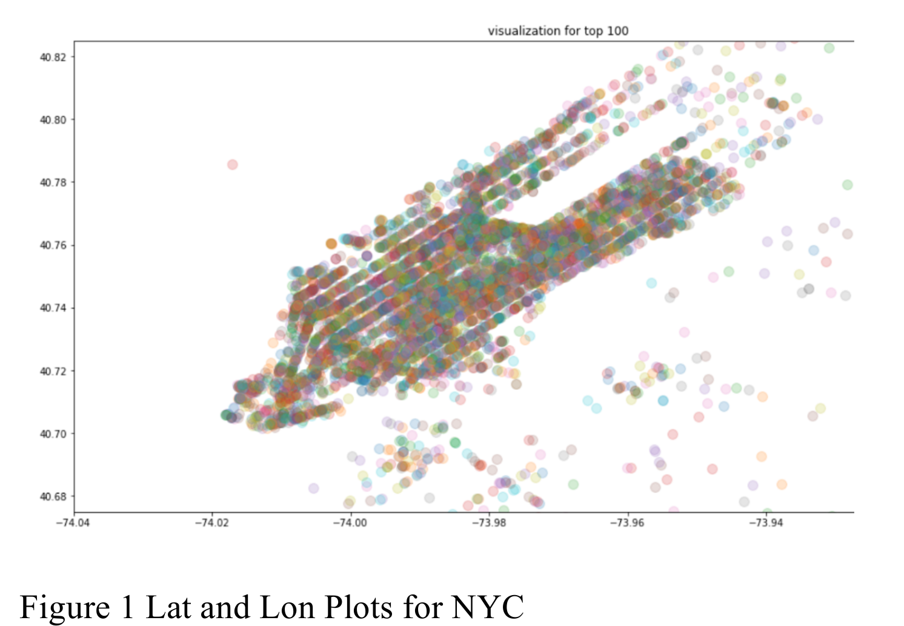
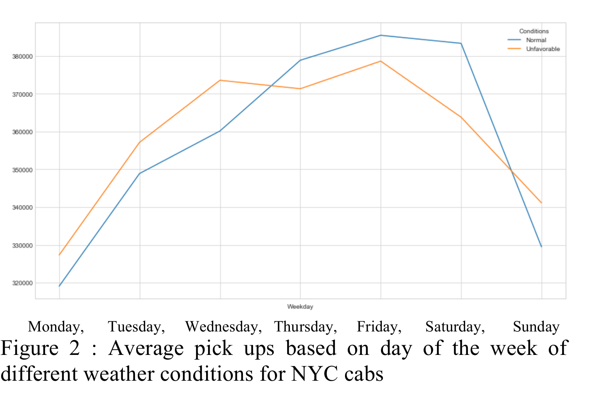
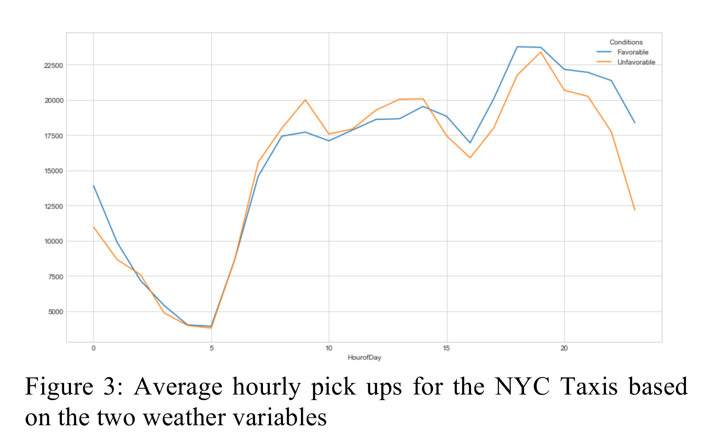
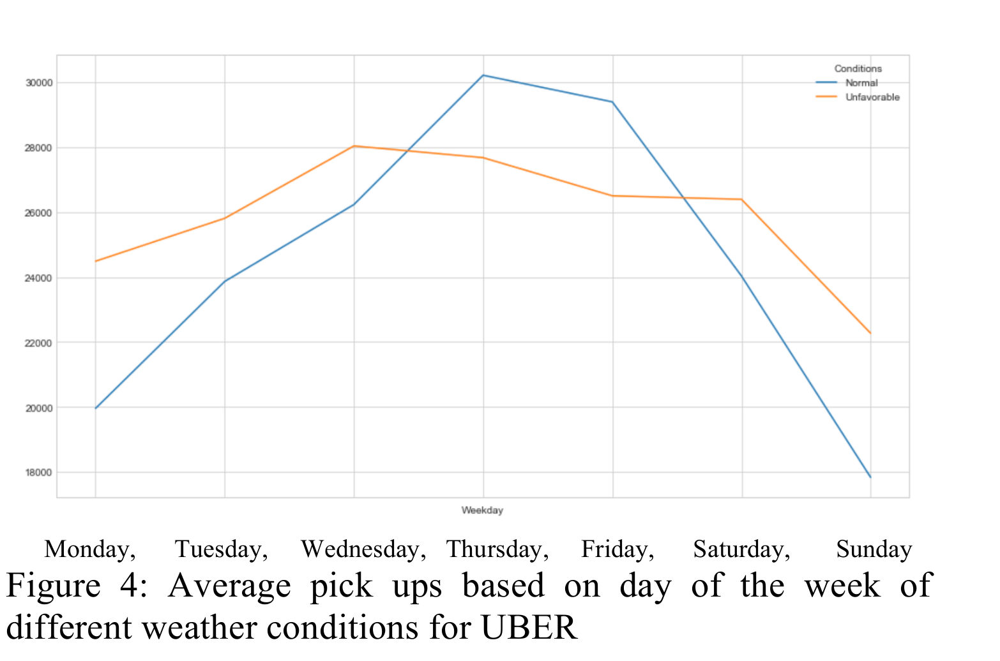
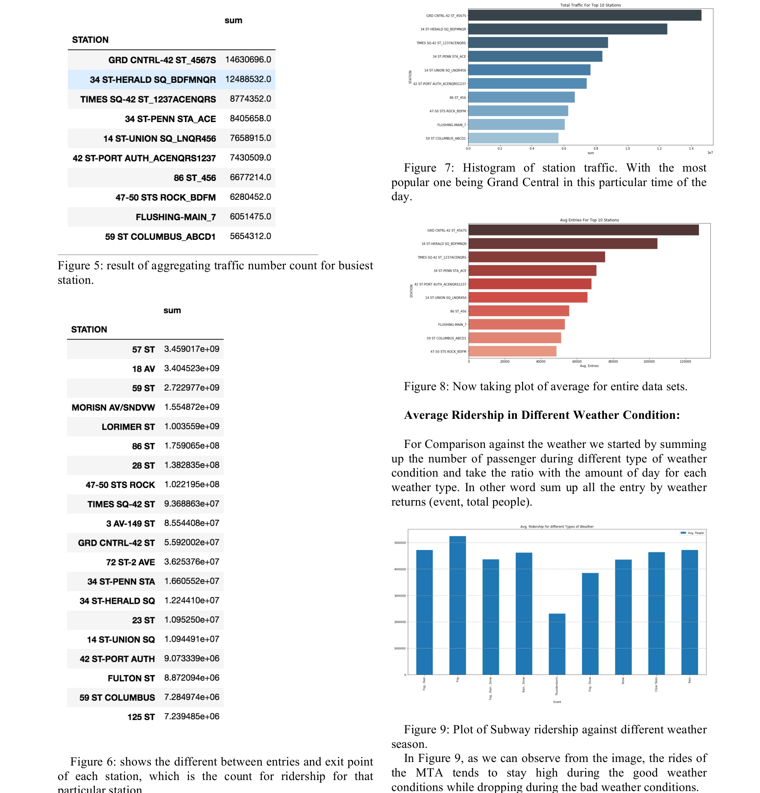
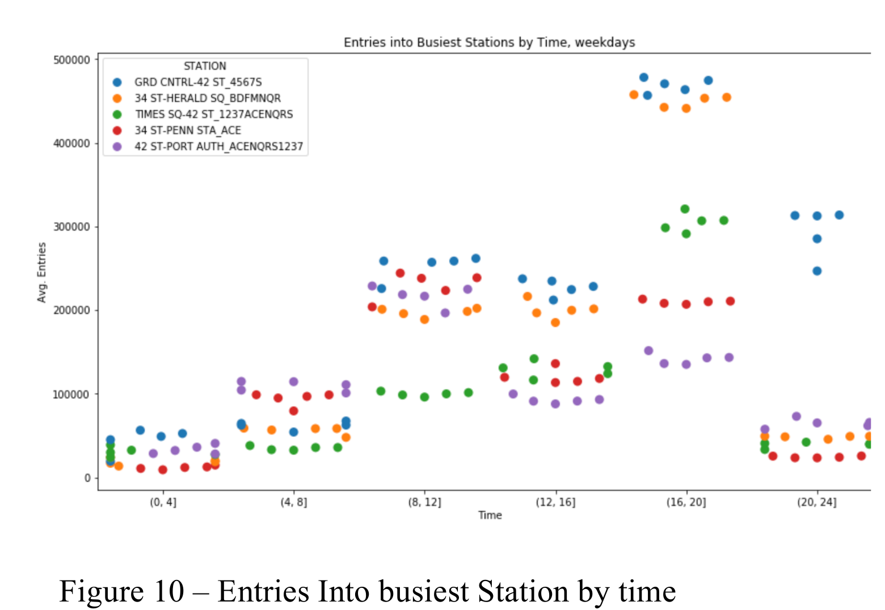
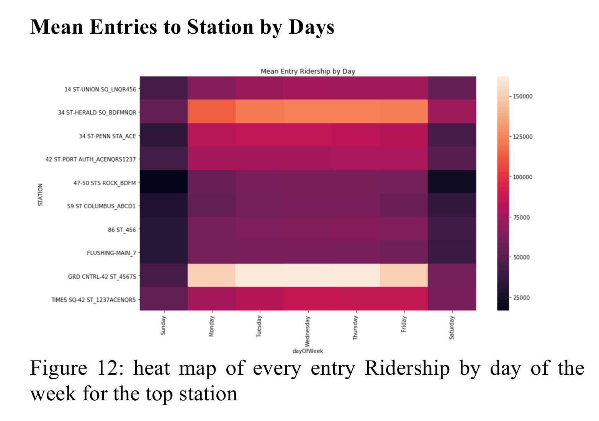
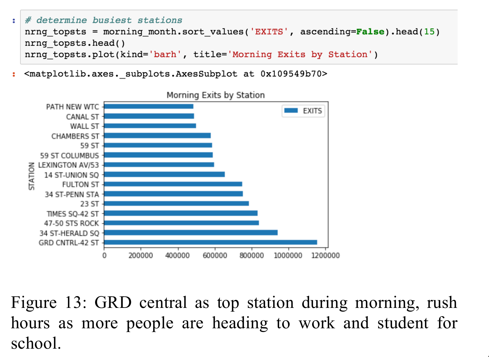
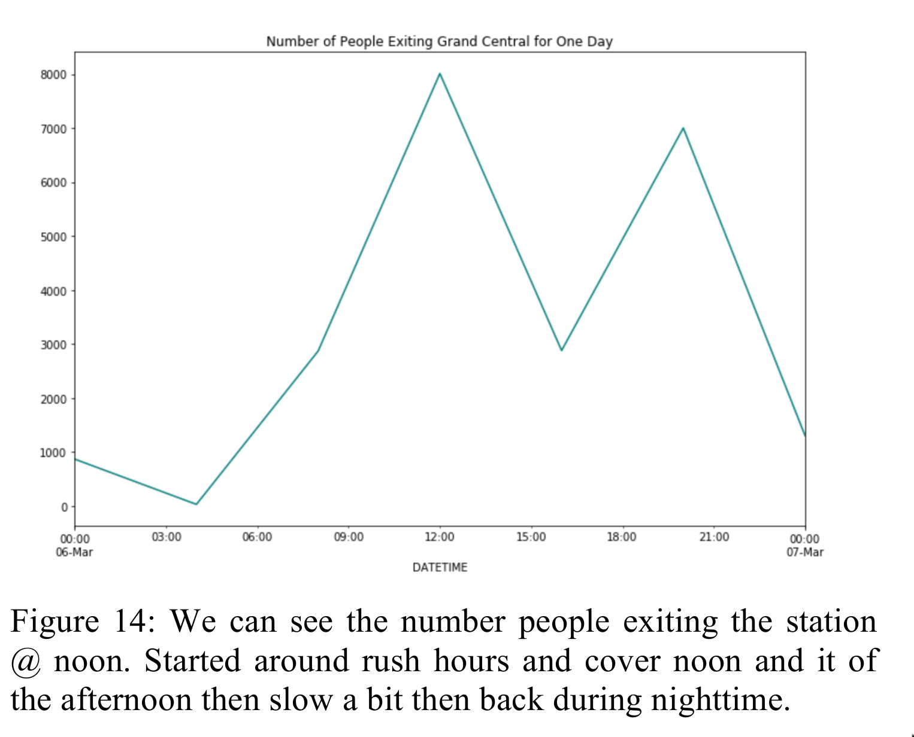

# NYC-Transport-and-Weather-Analysis
The motivation of our project is to analyze the effects of weather such as rain, snow or a normal sunny day on city like NYC, modes of transportations. Our hypothesis is that an
unfavorable weather conditions such as rain or snow should divert more people into the using the taxis as the means of transportations, more so to even get to a train. we assume that weather could influence people into choosing taxis as the means of transportation, during unfavorable weather condition. On the other hand, favorable weather conditions like a cloudy or a sunny day could prompt people to ride the Subways

## Methodology 
In order to analyze the MTA Turnstile dataset Available for 10GB Taxi data for made publicly available from the NYC.gov which size is approx. 10 GB we first used tool like Pandas to clean and prepare how data before any processing or analysis. After cleaning and combining the necessary table require for analysis, the size of our data, required us to make use of Apache Spark along with Hadoop Distributed File System (HDFS). Using the HDFS as storage for our data and Apache Spark to access the data on the HDFS, we were able to write functions that would go through the data using the processing power on the clusters to perform the operation need for our results.

## Results and visualization

